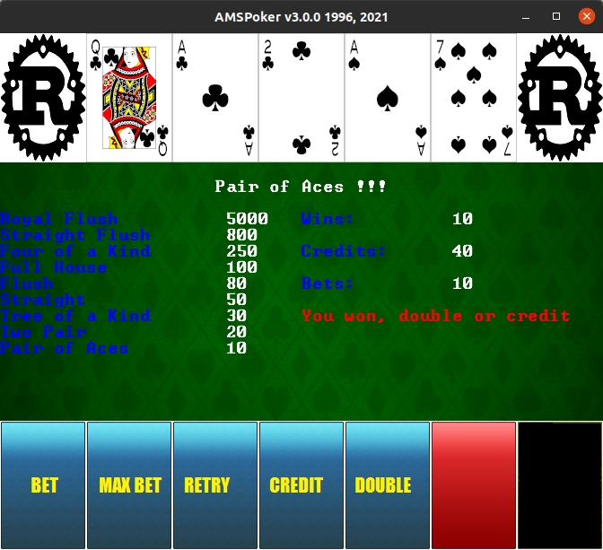

# AMSPoker v3a

## Description

Poker Game written in Rust/bracket-lib, based on the original I wrote in 1996 with Borland C++/OWL.



## Dependencies

* [bracket-lib](https://github.com/amethyst/bracket-lib)


## Build and run

```
cargo build --release

cargo run --release
```

## Author

* [Antonio Soares](https://github.com/ccie18473)

## License

This project is licensed under the [MIT] License - see the LICENSE.md file for details

